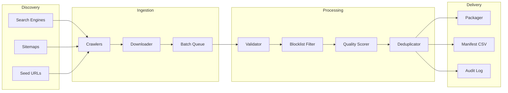

# System Architecture

## High-Level Flow



## Component Responsibilities

### Discovery Layer (`src/discovery/`)

- Generates candidate URLs from search queries, sitemaps, and seed lists
- Outputs URL queue with crawl metadata to `data/staging/urls/`

### Crawler Layer (`src/crawlers/`)

- Fetches web pages, extracts presentation file links
- Respects robots.txt and rate limits
- Emits file candidates with source context

### Download Layer (`src/download/`)

- Downloads files to `data/raw/{batch_id}/`
- Manages batch IDs and retry logic
- Records HTTP metadata and timestamps

### Validation Layer (`src/validation/`)

- File integrity check (python-pptx, PyMuPDF)
- Format verification
- Slide/page count

### Filtering Layer (`src/filtering/`)

- Blocklist matching (YAML configs)
- AI-assisted exclusion for edge cases
- Quality score gating
- Duplicate detection (perceptual hash + content hash)

### Analysis Layer (`src/analysis/`)

- OCR for text density
- Computer vision for graphics detection
- AI vision model for modernity scoring
- Thumbnail generation for hashing

### Metadata Layer (`src/metadata/`)

- Schema enforcement (Pydantic models)
- Metadata extraction from files and web context
- Audit log writer (JSONL)

### Delivery Layer (`src/delivery/`)

- File renaming and packaging
- CSV manifest generation
- Progress reporting

## Data Flow

```
URL Queue (JSONL)
  → Downloaded File + Sidecar Metadata (JSON)
    → Validation Result
      → Filter Result + Scores
        → Qualified File (renamed) + Manifest Row + Audit Entry
```

## Storage Layout

```
data/
├── staging/
│   └── urls/
│       └── BATCH-20260703-001.jsonl      # URL queue
├── raw/
│   └── BATCH-20260703-001/
│       ├── original_name.pptx
│       └── original_name.pptx.meta.json   # Sidecar metadata
├── qualified/
│   └── BATCH-20260703-001/
│       └── BATCH-20260703-001_000001.pptx
├── rejected/
│   └── BATCH-20260703-001/
│       └── ...                            # Optional retention
├── audit/
│   └── BATCH-20260703-001.jsonl
└── manifests/
    └── BATCH-20260703-001.csv
```

## Scaling Strategy

| Component      | Single Machine    | Scaled                      |
| -------------- | ----------------- | --------------------------- |
| Discovery      | 1 worker          | 4–8 workers                 |
| Download       | 16 concurrent     | 50–100 across VMs           |
| Validation     | Multiprocessing   | Job queue per CPU           |
| Vision scoring | Local GPU         | GPU cluster batch inference |
| Dedup          | SQLite hash index | Redis / PostgreSQL          |
| Storage        | Local disk        | S3 / Azure Blob             |

## Technology Stack

| Purpose           | Library                                |
| ----------------- | -------------------------------------- |
| HTTP / Crawling   | `httpx`, `scrapy` or `playwright`      |
| PPT parsing       | `python-pptx`                          |
| PDF parsing       | `PyMuPDF` (fitz)                       |
| OCR               | `pytesseract` or `easyocr`             |
| Vision / CV       | `opencv-python`, `Pillow`, `imagehash` |
| AI classification | OpenAI / Anthropic API                 |
| Config            | `PyYAML`, `pydantic-settings`          |
| CLI               | `click` or `typer`                     |
| Queue             | `redis` + `rq` or `celery`             |
| Database          | `SQLite` (dev) / `PostgreSQL` (prod)   |

## Metadata Schema

See `src/metadata/schema.py` for the canonical `FileRecord` and `AuditEntry` Pydantic models.

## Error Handling

- Transient download failures: retry 3x with exponential backoff
- Corrupt files: reject with `CORRUPT` reason, retain audit entry
- Missing source URL: reject immediately, never accept
- AI API failures: fall back to CV-only scoring, flag for re-score
